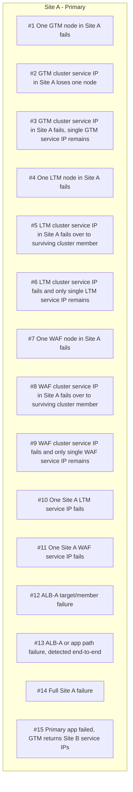

# F5 GTM/LTM/WAF Dual-Site Failure Matrix and Private DNS Considerations

This document reflects a dual-site private B2B topology where each site contains a 2-node GTM cluster plus 1 standalone GTM, a 2-node LTM cluster plus 1 standalone LTM, and a 2-node WAF cluster plus 1 standalone WAF. At the service-IP layer, clustered components should appear as **one IP per cluster service**, so the logical topology exposed to clients and upstream health logic is simplified. The GTM layer therefore exposes **four GTM service IPs in total**: two primary service IPs mapped to Site A and two secondary service IPs mapped to Site B. Each site also exposes **two LTM service IPs** and **two WAF service IPs**, with each clustered pair represented by one service IP and the standalone device represented by one service IP. The application sits behind an AWS Application Load Balancer (ALB) in each site.[cite:33][cite:50][cite:7]

The timing assumptions use common default health-monitor values unless noted otherwise: GTM BIG-IP monitor interval 30 seconds and timeout 90 seconds[cite:33], LTM HTTP/HTTPS monitor interval 5 seconds and timeout 16 seconds[cite:36][cite:17], and ALB target-group health checks with a 30-second interval, 2 failed checks to mark a target unhealthy, and 5 successful checks to mark a target healthy again[cite:7][cite:21].

## Interpretation rules

- Detection delay = time until the relevant monitoring layer marks the object or path unhealthy.
- Failover time = time until new requests are expected to use an alternate healthy path.
- Failover SLA = planning target for user-visible redirection under the default monitor settings above.
- For a **single node failure inside a healthy cluster**, the expected user impact is normally **none** for new requests, because the service IP remains available through the surviving cluster member; only in-flight connections already anchored to the failed node may see a reset or retry condition.
- For application-path failures, the outcome depends heavily on whether the F5 monitor is a true end-to-end HTTP/HTTPS monitor with request/response validation, or only a basic connect/port check. F5 HTTP/HTTPS monitors can validate response content when send/receive strings are configured[cite:36].
- GTM behavior depends not only on node health, but also on whether all GTM devices converge on the same current view of healthy virtual servers, pools, and application targets. Inconsistent GTM state can create different answers from different GTM service IPs until health information converges[cite:33][cite:74].

## Updated solution

The recommended private B2B design is to keep corporate recursive DNS as the client-facing resolver tier and have it delegate or conditionally forward only the application zones to the GTM listeners[cite:50][cite:74]. GTM remains authoritative for the delegated application namespaces, while corporate DNS handles the rest of the private namespace and client-specific resolver behavior such as VPN split DNS[cite:50][cite:57][cite:69].

The GTM tier should answer with one of four GTM service IPs, two representing primary-site preference and two representing secondary-site preference. Each GTM service IP then resolves to the relevant LTM service IP for that site, and each LTM service IP should select healthy WAF service IPs inside the same site before forwarding to the local ALB and then to the application tier[cite:50][cite:33][cite:36].

If the application is active/passive, GTM typically prefers the primary-site service IPs until Site A is declared unavailable or administratively deprioritized. If the application is active/active, GTM may legitimately return service IPs from both sites at the same time, which changes user behavior during failover because traffic may already be spread across both sites before a fault occurs[cite:33][cite:74].

## Topology diagram

```mermaid
flowchart LR
    C[Windows / Linux / macOS Client]
    R[Corporate Recursive DNS]

    subgraph GSLB[Delegated / Forwarded App Zone on GTM]
        G1[GTM Service IP P1\nSite A preference]
        G2[GTM Service IP P2\nSite A preference]
        G3[GTM Service IP S1\nSite B preference]
        G4[GTM Service IP S2\nSite B preference]
    end

    subgraph A[Site A - Primary]
        direction TB
        subgraph AG[GTM nodes]
            A_G1[GTM-A1]
            A_G2[GTM-A2]
            A_G3[GTM-A3 single]
        end
        subgraph ALSVC[Site A LTM service IPs]
            A_LC[LTM Cluster Service IP A-C]
            A_LS[LTM Single Service IP A-S]
        end
        subgraph ALN[Site A LTM nodes]
            A_L1[LTM-A1]
            A_L2[LTM-A2]
            A_L3[LTM-A3 single]
        end
        subgraph AWSVC[Site A WAF service IPs]
            A_WC[WAF Cluster Service IP A-C]
            A_WS[WAF Single Service IP A-S]
        end
        subgraph AWN[Site A WAF nodes]
            A_W1[WAF-A1]
            A_W2[WAF-A2]
            A_W3[WAF-A3 single]
        end
        A_ELB[ALB-A]
        A_APP[Application-A]
    end

    subgraph B[Site B - Secondary]
        direction TB
        subgraph BG[GTM nodes]
            B_G1[GTM-B1]
            B_G2[GTM-B2]
            B_G3[GTM-B3 single]
        end
        subgraph BLSVC[Site B LTM service IPs]
            B_LC[LTM Cluster Service IP B-C]
            B_LS[LTM Single Service IP B-S]
        end
        subgraph BLN[Site B LTM nodes]
            B_L1[LTM-B1]
            B_L2[LTM-B2]
            B_L3[LTM-B3 single]
        end
        subgraph BWSVC[Site B WAF service IPs]
            B_WC[WAF Cluster Service IP B-C]
            B_WS[WAF Single Service IP B-S]
        end
        subgraph BWN[Site B WAF nodes]
            B_W1[WAF-B1]
            B_W2[WAF-B2]
            B_W3[WAF-B3 single]
        end
        B_ELB[ALB-B]
        B_APP[Application-B]
    end

    C -->|Normal client query| R
    R -->|Delegation or conditional forward| G1
    R -->|Delegation or conditional forward| G2
    R -->|Delegation or conditional forward| G3
    R -->|Delegation or conditional forward| G4

    G1 -->|Primary preference| A_LC
    G2 -->|Primary preference| A_LS
    G3 -->|Secondary preference| B_LC
    G4 -->|Secondary preference| B_LS

    A_LC --> A_L1
    A_LC --> A_L2
    A_LS --> A_L3

    A_L1 --> A_WC
    A_L2 --> A_WC
    A_L3 --> A_WS

    A_WC --> A_W1
    A_WC --> A_W2
    A_WS --> A_W3

    A_W1 --> A_ELB
    A_W2 --> A_ELB
    A_W3 --> A_ELB
    A_ELB --> A_APP

    B_LC --> B_L1
    B_LC --> B_L2
    B_LS --> B_L3

    B_L1 --> B_WC
    B_L2 --> B_WC
    B_L3 --> B_WS

    B_WC --> B_W1
    B_WC --> B_W2
    B_WS --> B_W3

    B_W1 --> B_ELB
    B_W2 --> B_ELB
    B_W3 --> B_ELB
    B_ELB --> B_APP
```

## Scenario numbering diagram

## Failure matrix

| # | Failure scenario | Detection delay | Failover time for new requests | Expected user impact | User action likely required | Planning failover SLA |
|---|---|---:|---:|---|---|---:|
| 1 | One GTM node in Site A fails | Near-immediate operational event if the GTM cluster service IP or the standalone GTM service IP still answers DNS. | None for healthy DNS design; corporate DNS should still receive authoritative answers from remaining Site A or Site B GTM service IPs. | Normally no impact. | None, or a retry if a resolver initially queried a failed listener path. | 0-5 seconds |
| 2 | One node inside the Site A GTM cluster fails, but the GTM cluster service IP remains up | Normally no user-visible detection event, because the cluster service IP still answers and the service abstraction remains healthy. | None for new lookups if the cluster service IP is still active through the surviving node. | Normally no impact. | None. | No user-visible failover expected |
| 3 | Site A GTM cluster service IP fails, but the Site A standalone GTM service IP remains | Depends on corporate DNS or resolver behavior toward the remaining authoritative service IPs rather than on application-path health timers[cite:50][cite:79]. | Normally none to near-immediate if the standalone GTM service IP remains authoritative and reachable. | Normally no impact, but DNS redundancy is reduced. | Retry only if a resolver initially chose the failed cluster service IP. | 0-5 seconds |
| 4 | One LTM node in Site A fails | If the failed node sits behind the LTM cluster service IP, the cluster service IP can remain healthy through the surviving node; if it is the standalone LTM, the standalone service IP itself is affected[cite:33]. | None for new requests when the failure is inside the clustered pair; otherwise GTM may need up to 30 seconds normally and 90 seconds worst-case to stop preferring the affected standalone service IP[cite:33]. | Normally no impact when the clustered service IP survives. | Retry/refresh only for flows already pinned to the failed node. | No user-visible failover expected for clustered-member loss; 30 seconds normal and 90 seconds worst-case for standalone service withdrawal |
| 5 | One node inside the Site A LTM cluster fails, but the LTM cluster service IP remains up | Normally no user-visible detection event because the LTM cluster service IP still accepts traffic and the surviving cluster member continues service. | None for new requests. | Normally no impact. | None, or retry for in-flight sessions only. | No user-visible failover expected |
| 6 | The Site A LTM cluster service IP fails, and only the standalone Site A LTM service IP remains | GTM BIG-IP monitoring defaults are 30-second interval and 90-second timeout[cite:33]. | New requests should continue through the standalone Site A LTM service IP after GTM withdraws the failed clustered service IP, normally within 30 seconds and worst-case 90 seconds[cite:33]. | Normally low or no impact if the standalone service has enough capacity. | Retry/refresh for in-flight sessions on the failed clustered service IP; full login only if state was not replicated. | 30 seconds normal; 90 seconds worst-case |
| 7 | One WAF node in Site A fails | If the failed node sits behind the WAF cluster service IP, the cluster service IP can remain healthy through the surviving node; if it is the standalone WAF, the standalone WAF service IP is affected[cite:36][cite:17]. | None for new requests when the failure is inside the clustered WAF pair; otherwise LTM may need about 16 seconds to stop selecting the affected standalone WAF service IP[cite:36][cite:17]. | Normally no impact when the clustered WAF service IP survives. | Retry/refresh only for connections already on the failed WAF node. | No user-visible failover expected for clustered-member loss; under 16 seconds for standalone service withdrawal |
| 8 | One node inside the Site A WAF cluster fails, but the WAF cluster service IP remains up | Normally no user-visible detection event because the WAF cluster service IP still accepts traffic through the surviving node. | None for new requests. | Normally no impact. | None, or retry for in-flight sessions only. | No user-visible failover expected |
| 9 | The Site A WAF cluster service IP fails, and only the standalone Site A WAF service IP remains | LTM should detect the loss of the WAF cluster service IP in about 16 seconds[cite:36][cite:17]. | New requests should continue through the standalone WAF service IP in Site A once LTM removes the failed clustered WAF service IP, usually within about 16 seconds[cite:36][cite:17]. | Normally low or no impact if the standalone WAF has enough capacity. | Retry/refresh for in-flight sessions on the failed clustered WAF service IP. | Under 16 seconds |
| 10 | One Site A LTM service IP fails | If the surviving Site A LTM service IP remains healthy, GTM can keep traffic inside Site A without cross-site failover[cite:33]. | Normally within 30 seconds for GTM to stop preferring the failed Site A LTM service IP and keep using the surviving Site A LTM service IP[cite:33]. | Normally no impact if the remaining Site A LTM service IP has capacity. | Retry/refresh only for requests directed to the failed service IP. | 30 seconds normal; 90 seconds worst-case |
| 11 | One Site A WAF service IP fails | If the surviving Site A WAF service IP remains healthy, LTM can keep service local to Site A[cite:36][cite:17]. | Usually within about 16 seconds for LTM to stop selecting the failed Site A WAF service IP and use the surviving Site A WAF service IP[cite:36][cite:17]. | Normally no impact if the remaining Site A WAF service IP has capacity. | Retry/refresh only for requests already mapped to the failed WAF service IP. | Under 16 seconds |
| 12 | ALB-A target/member failure | ALB target health defaults use 30-second interval and 2 failed checks, so unhealthy detection is about 60 seconds[cite:7][cite:21]. | ALB removes that failed target from service in about 60 seconds while Site A remains active[cite:7][cite:21]. | Normally no impact if other app targets remain healthy. | Usually none; at most a browser refresh if a request was in flight to the failed target. | Under 60 seconds |
| 13 | ALB-A or app path failure, detected by end-to-end F5 HTTP/HTTPS monitor | ALB target health alone would detect full target failure in about 60 seconds[cite:7][cite:21]. A true end-to-end F5 HTTP/HTTPS monitor that validates the application response can detect the broken path in about 16 seconds[cite:36][cite:17]. | About 16-46 seconds normally for Site B failover, or about 106 seconds worst-case if GTM waits for its full timeout after LTM sees the broken path[cite:36][cite:17][cite:33]. | User-visible interruption during cross-site failover. | Refresh/retry may be enough if sessions are shared across sites; full login is required if authentication or session state is local to Site A. | 46 seconds normal; 106 seconds worst-case |
| 14 | Full Site A failure | GTM BIG-IP monitor defaults imply 30 seconds normal and 90 seconds worst-case to mark Site A down[cite:33]. | New requests should move to the two secondary GTM service IPs and then to Site B LTM service IPs once GTM withdraws Site A[cite:33]. | Short outage for fresh requests until GTM answers only with secondary-site service IPs. | Refresh/retry normally; full login often required if session state is not shared across sites. | 30 seconds normal; 90 seconds worst-case |
| 15 | Primary application service failed and GTM returns the two Site B service IPs | With end-to-end HTTP/HTTPS monitoring, the broken application path can be detected in about 16 seconds[cite:36][cite:17]. If detection relies only on ALB target health, it may begin around 60 seconds[cite:7][cite:21]. | About 16-46 seconds normally with end-to-end monitoring, or roughly 60-90 seconds with default-only ALB plus GTM-driven withdrawal[cite:36][cite:17][cite:7][cite:21][cite:33]. | User-visible failover unless the application is fully active-active and session-aware across sites. | Refresh/retry if sessions are globally shared; full login if SSO, cookies, or session stores are site-local. | 46 seconds target with end-to-end monitoring; 90 seconds conservative upper target otherwise |

## Direct client DNS behavior

The preferred model is for clients to use corporate recursive DNS and not query GTM service IPs directly[cite:50][cite:57][cite:69]. When clients directly connect to GTM DNS servers, behavior can differ by operating system, VPN client, resolver library, interface order, and local caching rules, which makes failover observations less consistent across Windows, Linux, and macOS[cite:57][cite:69][cite:71].

Windows can apply namespace-specific DNS rules through the Name Resolution Policy Table, so a direct-to-GTM test from a Windows endpoint may not behave like a production query path through corporate DNS[cite:57]. macOS uses a multi-resolver model and treats `.local` specially via mDNS, so direct resolution behavior can differ from tools like `dig` that bypass part of the normal application resolver path[cite:71]. Linux behavior can vary based on whether the system uses `systemd-resolved`, NetworkManager, or static `resolv.conf`, especially when VPN split DNS is involved[cite:69].

Direct client access to GTM can also bypass the intended enterprise controls for delegation, forwarding, DNS logging, recursion policy, and caching. In a private B2B design, this often creates inconsistent failover observations because some clients query a local corporate resolver while others query GTM listeners directly and receive answers based on different caches, retry timing, and reachable listener IPs[cite:50][cite:79].

## GTM convergence and application mode

All GTM devices should converge on the same healthy set of application targets, service IPs, and site states before the solution can be considered operationally stable[cite:33][cite:74]. If one GTM service IP believes Site A is healthy while another already believes only Site B is healthy, different resolvers can receive different answers for the same name during the convergence window[cite:33][cite:74].

This is especially important in private networks where multiple corporate DNS resolvers, leased-line latency, VPN failover, or intermittent reachability to individual GTM listeners can create different query paths. The design should therefore validate monitor propagation, synchronization of GTM objects, and consistent health visibility from all GTM nodes before relying on the documented failover times[cite:33][cite:50][cite:74].

Application operating mode also changes the expected behavior. In active/passive mode, failover usually means a clearer transition from Site A answers to Site B answers after health thresholds are crossed, while in active/active mode, both sites may already be in rotation and “failover” can look more like rebalancing than a binary cutover[cite:33][cite:74]. Because of that, site preference policy, persistence method, state replication, and whether sessions are portable across sites can all affect real user experience and the observed failover time even when GTM monitor timers stay the same[cite:33][cite:36].

## Six GTM DNS servers

Using six DNS-capable GTM nodes across the two sites is not automatically a problem, because DNS zones are expected to have at least two authoritative name servers and more can be used[cite:79]. In this topology, the six GTM nodes are the authoritative DNS platform behind a corporate recursive DNS tier, while the **four GTM service IPs** represent the application-resolution logic exposed to clients through that DNS platform[cite:50][cite:79].

The main risk with six GTM DNS nodes is operational consistency rather than protocol correctness. Every delegated or forwarded path must stay synchronized, all six nodes must answer authoritatively for the zone, and none of the advertised NS records should become lame delegations[cite:79].

## Client OS and private DNS considerations

Windows can apply namespace-specific DNS behavior through the Name Resolution Policy Table, so VPN and split-DNS policies may override what the adapter configuration seems to show[cite:57]. macOS uses a multi-resolver model and treats `.local` specially via mDNS, so `.local` should be avoided for this private service namespace[cite:71]. Linux behavior varies by resolver stack, especially when `systemd-resolved` and VPN split DNS are involved[cite:69].

Because this is a private leased-line or VPN-connected environment, the design should assume that client operating systems see only corporate recursive DNS, while corporate DNS delegates or forwards the application subzones to GTM[cite:50][cite:57][cite:69]. That keeps the client behavior consistent and moves the complexity into a controlled DNS layer rather than every endpoint[cite:50][cite:57].

## Login versus retry guidance

The scenarios below normally need only a browser refresh, retry, or no action at all, provided the application session is not tied to the failed node: #1, #2, #3, #4 for clustered-member loss, #5, #7 for clustered-member loss, #8, #9, #10, #11, and #12. These are cases where a healthy peer node, service IP, or app target remains available in the same layer or site, so the failure is a member-withdrawal event rather than a full site move[cite:33][cite:36][cite:17][cite:7][cite:21].

The scenarios that may require a full HTTP login are #6, #13, #14, and #15, because they commonly result in a site change or a restart of the end-to-end transaction path. Whether a full login is truly required depends on application design, including shared session storage, replicated authentication state, common cookie domain, cross-site persistence, and whether Site B can honor the same authenticated session as Site A.

## Practical validation notes

- For single-node failures behind clustered GTM, LTM, or WAF service IPs, the design expectation should be **no user-visible impact for new requests** if the clustered service IP remains healthy and capacity is sufficient.
- For those same single-node failures, existing connections already on the failed member may still see a reset and need a retry.
- To make #13, #14, and #15 predictable, use an end-to-end HTTP/HTTPS monitor that validates a known-good application response rather than only a TCP or TLS handshake[cite:36].
- If the business requirement is “alternative site must work without re-login,” the application must support cross-site session continuity; that outcome is not guaranteed by GTM/LTM/WAF health checks alone.
- Validate not only monitor timers, but also GTM convergence across all authoritative GTM devices and all four GTM service IPs before accepting any failover SLA as operationally proven[cite:33][cite:74].
