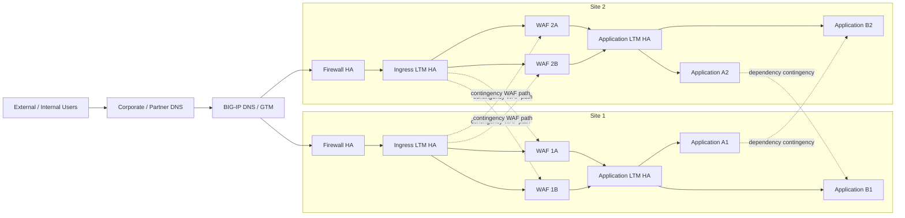

# Enterprise WAF Architecture Options and Cross-Site Resilience

## Purpose

This page compares two WAF deployment models and two routing models for a dual-site enterprise application environment:

1. **Clustered WAFs** versus **LTM load-balanced WAF nodes**.
2. **Local-only routing** versus **controlled cross-site contingency routing**.

It also considers:

- cascading failures between dependent applications;
- internal system-to-system traffic;
- external users arriving over leased lines and VPNs;
- BIG-IP DNS / GTM and LTM responsibilities;
- the impact of active/passive and active/active applications;
- avoiding a site-wide failover because one infrastructure or application component fails.

The design objective is to keep the following as **separate failure domains** wherever possible:

- external connectivity;
- firewall tier;
- ingress LTM tier;
- WAF tier;
- application LTM tier;
- individual application;
- application dependency;
- inter-site network;
- full site.

A failure in one domain should not automatically force all applications in the site to fail over.

---

# 1. Executive recommendation

Where an LTM can load-balance the WAF tier, the preferred strategic architecture is:

> **Ingress LTM HA pair -> pool of independently active WAF nodes -> application LTM / application**, with WAF policy/configuration synchronisation separated from dataplane failover.

For cross-site resilience:

> **Keep traffic local during normal operation, but provide tightly controlled cross-site contingency routes for WAF capacity and application dependencies.**

Cross-site capability should be treated as a **recovery path**, not a normal dependency. Loss of the inter-site path should therefore remove contingency options but should **not** interrupt applications whose local components remain healthy.

Recommended high-level topology:



The dashed paths should be explicitly controlled, monitored and normally unused unless required.

---

# 2. Clustered WAF versus LTM load-balanced WAF

## 2.1 Clustered WAF model

Typical local design:

```text
Ingress / Firewall
        |
   WAF HA Cluster
   Active / Standby
        |
 Application LTM
        |
    Application
```

The WAF cluster provides the service IP and performs node failover.

### Advantages

- Mature and familiar BIG-IP HA model.
- WAF service IP can remain stable during a member failure.
- Configuration and failover state can be tightly integrated.
- Connection/session state can potentially be preserved better where supported and configured.
- Simple upstream routing because the WAF pair appears as one logical service.

### Disadvantages

- In active/standby mode, a significant portion of appliance capacity is normally unused.
- The WAF cluster becomes its own HA dependency and shared failure/change domain.
- A configuration problem can be synchronised across both members.
- Capacity scaling is less natural than simply adding another member to an LTM pool.
- Maintenance often requires explicit HA operations and traffic-group awareness.
- If the whole clustered service becomes unavailable, recovery still requires another local WAF service, cross-site capacity or application/site failover.

---

## 2.2 LTM load-balanced WAF model

Preferred model when an ingress LTM is available:

```text
                 +--> WAF-1A --+
Ingress LTM HA --+             +--> Application LTM --> App
                 +--> WAF-1B --+
```

Both WAFs can be active traffic-processing nodes. The ingress LTM performs health monitoring, load balancing and node withdrawal.

### Advantages

- Both WAF appliances contribute usable capacity.
- Failure of one WAF is handled as a pool-member failure rather than an HA traffic-group event.
- Easier scale-out: add WAF-1C or WAF-1D as pool members.
- Easier maintenance: disable/drain one node, patch it, test it, then return it to service.
- Per-application or per-service health checks can be used instead of one global WAF health state.
- Lower risk that a single WAF appliance failure causes broad application failover.
- Remote WAF nodes can be introduced as lower-priority contingency members where routing permits.

### Disadvantages / design considerations

- Connections currently anchored to a failed WAF may reset and need retry.
- WAF policies and supporting configuration must still be kept consistent across nodes.
- Features with local runtime state, learning, bot state, DoS state, persistence or rate limiting must be validated for multi-node behaviour.
- Return-path symmetry must be maintained through the selected WAF.
- The ingress LTM tier becomes an important dependency and must itself be highly available.

F5 documents BIG-IP pools, health monitors and priority-group activation as core LTM functions. F5 also documents off-box Advanced WAF as a separate inspection service for scale and flexibility. F5 supports synchronising Application Security policies across devices through Sync-Only device groups. See references at the end of this page.

---

## 2.3 Comparison table

| Design area | Clustered WAF | LTM load-balanced WAF |
|---|---|---|
| Normal dataplane | Usually one logical clustered service | Multiple simultaneously active pool members |
| Capacity utilisation | Lower in active/standby mode | Higher; all healthy nodes can carry traffic |
| Node failure action | WAF HA failover | Ingress LTM removes failed pool member |
| Single WAF failure blast radius | Normally low | Normally low |
| Whole WAF service failure | Requires alternate WAF/service/site | Can use remaining local members or remote contingency members |
| Horizontal scaling | Moderate complexity | Simple pool expansion |
| Maintenance | HA-oriented drain/failover | Pool-member drain/disable |
| Config consistency | Native HA/config sync | Requires Sync-Only/config automation discipline |
| Connection preservation | Potentially better with HA/state features | Failed-node connections generally retry/reset |
| Per-app health isolation | Possible but less natural if WAF exposed as one service | Strong; LTM pools/monitors can be app-specific |
| Cross-site capacity borrowing | Possible, but service abstraction can complicate it | Natural as lower-priority remote pool members |
| Operational model | Appliance/cluster centric | Service/pool centric |

### Preferred conclusion

If the ingress LTM tier already exists and can balance WAF traffic, **LTM-balanced active WAF nodes are generally the stronger enterprise service model** unless a specific WAF feature or state-preservation requirement makes WAF dataplane clustering necessary.

This does **not** mean the WAFs should be unmanaged standalone appliances. WAF policy and security configuration should still be synchronised or centrally deployed.

---

# 3. Local-only routing versus cross-site contingency routing

## 3.1 Local-only model

```text
Site 1 client -> Site 1 LTM -> Site 1 WAF -> Site 1 Application
Site 2 client -> Site 2 LTM -> Site 2 WAF -> Site 2 Application
```

There is no supported route from Site 1 WAF/LTM to Site 2 application infrastructure, or vice versa.

### Advantages

- Simpler routing and security policy.
- Easier traffic-flow troubleshooting.
- Reduced asymmetric routing risk.
- Inter-site network is not part of normal application delivery.
- Clear site boundary and simpler firewall rule base.

### Disadvantages

- Spare WAF capacity in the other site cannot protect a healthy local application.
- Local WAF-tier failure can force an application or full service to the other site even when the application itself remains healthy.
- A local dependency failure can force dependent applications to move sites.
- Planned maintenance can have a larger impact because there are fewer recovery choices.
- The design creates stronger coupling between infrastructure failure and application disaster recovery.

---

## 3.2 Controlled cross-site contingency model

Normal traffic remains local:

```text
Site 1 ingress LTM -> Site 1 WAF -> Site 1 App LTM -> Site 1 App
```

Contingency paths are additionally available:

```text
Site 1 ingress LTM -> Site 2 WAF -> Site 1 App LTM -> Site 1 App

or

Site 2 ingress LTM -> Site 2 WAF -> Site 1 App LTM -> Site 1 App
```

For internal dependencies:

```text
App A1 -> local Service-B LTM VIP -> B1 normally
                                 -> B2 on contingency
```

### Advantages

- WAF capacity can be borrowed across sites.
- A WAF-tier failure does not necessarily cause application failover.
- A dependent service can move sites without moving every application that uses it.
- Site failover can remain the final recovery step rather than the first recovery step.
- Maintenance can be performed with lower risk.
- Better use of otherwise idle DR capacity.

### Disadvantages

- Requires controlled inter-site routes and firewall policy.
- Requires deterministic return-path symmetry.
- Cross-site throughput must support contingency load.
- Monitoring must distinguish local service health from remote-path health.
- Troubleshooting becomes more complex because ingress site, WAF site and application site can differ.
- Cross-site traffic can create a trombone path and additional bandwidth consumption.

---

## 3.3 Recommended cross-site policy

Do **not** make the sites generally routable to each other.

Use explicit service flows such as:

```text
Site1-Ingress-LTM -> Site2-WAF-Pool : application HTTPS flows only
Site2-Ingress-LTM -> Site1-WAF-Pool : application HTTPS flows only
Site1-WAF         -> Site2-App-LTM  : approved backend VIPs only
Site2-WAF         -> Site1-App-LTM  : approved backend VIPs only
App-A1            -> Site2-B-VIP    : required application protocol only
App-A2            -> Site1-B-VIP    : required application protocol only
```

Default deny all unrelated inter-site application traffic.

The remote members should normally be configured as **lower-priority / contingency resources**, not as equal active members, unless the application is explicitly designed for active/active cross-site operation.

F5 LTM Priority Group Activation is directly useful for this pattern: higher-priority local members can receive traffic while they are healthy, with lower-priority remote members becoming eligible only when local capacity falls below the configured threshold.

---

# 4. Why cross-site routing reduces cascading failures

Consider App A in Site 1 depending on App B in Site 1.

## 4.1 Without cross-site routing

```text
A1 ---> B1
        X failure
```

If B1 fails and A1 has no route to B2:

```text
B1 failure
   |
   v
A1 loses dependency
   |
   v
A1 degraded/unavailable
   |
   v
Fail App A to Site 2
   |
   v
A2 -> B2
```

A failure of **App B** has now caused a failover of **App A**.

If C, D and E also depend on B, they may all need to fail over as well.

That is a cascading failure.

### Example cascade

```text
             B1 failure
                 |
      +----------+----------+
      |          |          |
     A1         C1         D1
      |          |          |
      v          v          v
   fail A     fail C     fail D
      \          |          /
       +---------+---------+
                 |
          Site 2 capacity spike
```

A small failure can therefore become a site-level event.

---

## 4.2 With cross-site contingency routing

```text
A1 ---> Service-B VIP
           |      \
           |       +====> B2 contingency
           v
          B1 preferred
```

When B1 fails:

```text
A1 -> Site1 LTM Service-B VIP -> B2
```

App A remains in Site 1.

Only the failed dependency moves.

This is normally a much smaller and more controlled failure domain.

---

# 5. Behaviour when the cross-site network fails

Cross-site routing should be a **resilience enhancement**, not a prerequisite for healthy local traffic.

Required behaviour:

| Condition | Expected result |
|---|---|
| Local A1 and B1 healthy; cross-site route lost | No application impact |
| Local WAF pool healthy; cross-site route lost | No user impact |
| A1 healthy, B1 failed, B2 healthy, cross-site available | A1 uses B2 |
| A1 healthy, B1 failed, cross-site unavailable | A1 becomes degraded/unavailable unless another local recovery exists |
| Local WAF tier failed, remote WAF available, cross-site available | Use remote WAF contingency path |
| Local WAF tier failed and cross-site unavailable | External service must use alternate ingress/site or application failover |
| Application currently using remote WAF and cross-site fails | Existing cross-site sessions fail; route back to local WAF if available or steer service to alternate site |

The critical rule is:

> **Loss of cross-site routing must not mark the whole local site unavailable if local application paths remain healthy.**

Do not configure a site-health expression equivalent to:

```text
SITE1_UP = APP_A AND APP_B AND APP_C AND CROSS_SITE_LINK
```

Instead use application/service-specific health conditions.

---

# 6. Internal system-to-system traffic

Internal system flows need separate design treatment from external user ingress.

Assume:

```text
Application A -> Application B
```

There are three main models.

## 6.1 Model 1 - hard-coded local endpoint

```text
A1 -> B1-IP
```

This should be avoided where resilience is required.

If B1 fails, A1 has no automatic alternative.

---

## 6.2 Model 2 - DNS / GTM-based service selection

```text
A1 -> b.internal.example
          |
          v
      BIG-IP DNS/GTM
        /        \
      B1          B2
```

### Advantages

- Can steer service calls between sites.
- Fits applications that already use DNS-based discovery.
- BIG-IP DNS can use health information from LTM systems.

### Limitations

- Applications may cache DNS responses.
- JVMs, application frameworks, proxies and connection pools may retain addresses for much longer than DNS TTL suggests.
- Existing persistent TCP/TLS sessions do not move because DNS changed.
- Convergence therefore depends on both DNS and the application's retry/re-resolution behaviour.

For internal east-west traffic, GTM should not automatically be assumed to provide rapid failover.

---

## 6.3 Model 3 - local LTM service VIP with remote fallback

Recommended where technically possible:

```text
A1
 |
 v
Site1 LTM VIP: B-Service
 |
 +--> B1   Priority 10 / preferred
 |
 +==> B2   Priority 5 / contingency
```

This gives the local LTM direct control over dependency failover.

### Benefits

- No dependency on DNS cache expiration for B1 -> B2 failover.
- A1 continues using one stable service address.
- Local service remains preferred.
- Remote service can be withdrawn immediately when the inter-site path fails.
- Failure of B does not automatically require failure of A.

### Requirement

A1 must be able to route to the Site 1 service VIP, and the Site 1 LTM must have an approved route from the service pool to B2 through the inter-site network.

---

# 7. DNS / GTM requirements

## 7.1 External user DNS

BIG-IP DNS / GTM should normally select between **site ingress LTM VIPs**, not individual WAF appliances.

```text
app.example.com
      |
      v
BIG-IP DNS / GTM
   /             \
Site1 ingress   Site2 ingress
LTM VIP         LTM VIP
```

GTM should have application-specific health rather than one blanket site health state.

For example:

```text
APP-A-SITE1-AVAILABLE
APP-A-SITE2-AVAILABLE
APP-B-SITE1-AVAILABLE
APP-B-SITE2-AVAILABLE
```

A failure of App B must not cause GTM to remove App A from the site unless A truly cannot provide service.

F5 documents BIG-IP DNS integration with LTM using iQuery/big3d so DNS can obtain virtual-server status and network-path information from BIG-IP systems.

---

## 7.2 Internal user DNS

Internal users may use:

- corporate recursive DNS;
- conditional forwarding or delegation to BIG-IP DNS for selected application zones;
- split DNS where internal users receive internal VIPs and external/partner users receive different VIPs.

The DNS design should preserve the distinction between:

```text
External client service VIP
Internal user service VIP
System-to-system service VIP
```

These do not have to resolve to the same destination.

---

## 7.3 System-to-system DNS

Where system-to-system flows use an LTM service VIP, DNS can remain simple:

```text
b.service.internal -> Site1 B-service VIP
```

The LTM then chooses B1 or B2 based on health and priority.

This is often preferable to making GTM responsible for every service dependency.

GTM remains valuable where:

- the calling application can exist in either site;
- different callers must receive different site-local service VIPs;
- an application is genuinely active/active;
- there is no suitable local LTM service abstraction;
- DNS-based site selection is already part of the application design.

---

# 8. External leased-line and VPN users

External users are constrained by **network reachability before DNS or WAF logic matters**.

GTM can return Site 2, but the client still requires a valid network path to Site 2.

Therefore:

> **DNS/GTM does not solve a leased-line routing limitation.**

## 8.1 Leased-line users

Assume four separate client connectivity pools and four firewall appliances arranged as two HA firewall pairs. The exact pool-to-firewall mapping should be confirmed.

Questions that must be answered for each client pool:

1. Can the client route to both Site 1 and Site 2 ingress VIPs?
2. Does the leased-line provider advertise both site prefixes?
3. Can the client fail between sites automatically, or is a routing change required?
4. Does the client's DNS resolver honour the GTM answer and TTL?
5. Does the client's firewall permit both site VIP ranges?
6. Is source-address preservation required end-to-end?

If a leased-line pool can reach only Site 1, then this will not work:

```text
GTM -> Site2 VIP
```

for that client.

Instead, Site 1 may need to remain the ingress point while Site 1 LTM uses remote WAF capacity or remote application services behind the scenes:

```text
Client leased line
      |
 Site1 firewall
      |
 Site1 ingress LTM
      |
      +====> Site2 WAF contingency
                 |
                 +====> Site1 application
```

This is one of the strongest reasons to retain selective cross-site infrastructure routing even when external clients themselves cannot route cross-site.

---

## 8.2 VPN users

VPN users are often more flexible if the VPN design can advertise or route both site service networks.

Possible recovery:

```text
VPN user -> GTM -> Site2 ingress -> Site2 WAF -> Site2 App
```

or, where the application remains active in Site 1:

```text
VPN user -> Site2 ingress -> Site2 WAF -> Site1 App
```

The second option allows the WAF/ingress service to move without moving application processing.

---

# 9. The 25% user-impact rule

If the operating requirement is that trading/service may remain open only while **less than 25% of users are affected**, client access failure domains need to be modelled explicitly.

If four connectivity pools are equal in size:

```text
Pool 1 = 25%
Pool 2 = 25%
Pool 3 = 25%
Pool 4 = 25%
```

then loss of one entire pool affects **25%**, which does not satisfy a strict requirement of **<25%**.

If two pools share one firewall HA pair, complete failure of that firewall pair could potentially affect approximately **50%** of clients, depending on the actual routing and client distribution.

The availability requirement should therefore be expressed as:

> **No single infrastructure failure should make 25% or more of eligible users unable to reach the service**, if the rule is strictly `<25%`.

Possible mitigations include:

- alternate route from each client pool to another firewall/site;
- dual-site route advertisement;
- VPN fallback for leased-line clients;
- redistributing users so no access failure domain reaches the threshold;
- additional firewall/access domains;
- documented interpretation of whether the requirement is `<25%` or `<=25%`.

---

# 10. Cascading-failure examples

| Failure | No cross-site route | Cross-site contingency available |
|---|---|---|
| One WAF node fails | Cluster/LTM local recovery | Same; local recovery |
| Entire local WAF tier fails | App/service may have to move site | Remote WAF can protect healthy local app |
| B1 fails, A1 depends on B | A1 degrades or A must fail to Site 2 | A1 can use B2 |
| Shared B1 used by A/C/D | Several apps may fail over | Only B dependency crosses sites |
| App A1 fails | A fails to A2 | Same; A only |
| Cross-site route fails while all local services healthy | No impact if design is local-only | No impact; contingency capability is lost only |
| Cross-site route fails while A1 is using B2 | Not applicable | A loses remote dependency unless B1 recovers |
| Cross-site route fails while Site1 uses Site2 WAF | Not applicable | Those sessions fail/re-route; other local services remain local |
| Site1 ingress LTM fails | Site/site-ingress failover required | GTM or alternate ingress required |
| One leased-line pool fails | Affected clients lose service unless alternate path | Same unless client has alternate path/VPN |

The objective is to prevent this pattern:

```text
one component failure
        |
        v
one application fails
        |
        v
dependent applications fail
        |
        v
whole site evacuated
        |
        v
secondary-site capacity spike
```

---

# 11. Health-monitoring model

Health monitoring should occur at several layers.

## Ingress LTM -> WAF

Check more than simple TCP reachability where possible.

F5 supports **transparent monitors**, where an LTM monitor can send a probe through a pool member such as a firewall/security device to an aliased destination beyond it. This is useful to detect a WAF that is alive but cannot correctly forward the protected application path.

Example:

```text
Ingress LTM monitor
       |
       v
      WAF1
       |
       v
Application health endpoint
```

## Application LTM -> application

Use service-specific HTTP/HTTPS or protocol health checks.

## Cross-site service member

A remote member should be considered available only when:

```text
Remote member healthy
AND
cross-site route healthy
AND
required firewall policy/path healthy
```

## GTM / BIG-IP DNS

GTM should evaluate the service presented by the site ingress LTM and application-specific availability, not merely whether the site or appliance responds to ping.

---

# 12. Routing and traffic-symmetry requirements

Cross-site WAF use can create asymmetric routing if not deliberately designed.

Bad example:

```text
Client -> Site1 LTM -> Site2 WAF -> Site1 App
Site1 App -> Site1 firewall -> Client
```

The response bypasses the WAF that owns the TCP/security state.

Preferred model:

```text
Client
  |
Site1 ingress LTM
  |
Site2 WAF
  |
Site1 App LTM / App
  |
Site2 WAF
  |
Site1 ingress LTM
  |
Client
```

SNAT, route domains, policy routing or another deterministic routing technique may be required to preserve symmetry.

If SNAT is used, preserve trusted original-client information at the application layer where required and ensure external clients cannot spoof trusted forwarding headers.

---

# 13. Active/passive applications

Many applications are active in Site 1 with Site 2 manually started only during DR.

For these applications, remote resources must not be selected simply because they exist in configuration.

Example:

```text
A1 = running / preferred
A2 = administratively unavailable or health-check down
```

When DR is declared:

```text
1. Start A2.
2. Validate application dependencies.
3. Health checks mark A2 available.
4. GTM/LTM makes A2 eligible.
5. Shift traffic according to the runbook.
```

Cross-site WAF capacity can still be useful while A1 remains active.

This allows recovery from a WAF failure without initiating full application DR.

---

# 14. Active/active applications

For applications designed for active/active operation:

- GTM may return both site ingress VIPs.
- Both WAF pools can carry normal traffic.
- Application state/session consistency must be supported across sites.
- Dependency routing may prefer local services while permitting remote services.
- Cross-site link capacity becomes more operationally significant because remote flows may be normal rather than exceptional.

Active/active application design does not automatically mean WAFs should be cross-site active for every flow. Local WAF processing should still normally be preferred to reduce inter-site dependency and bandwidth use.

---

# 15. Architecture option summary

| Option | WAF design | Cross-site routing | Resilience | Complexity | Capacity efficiency | Cascading-failure control | Assessment |
|---|---|---|---|---|---|---|---|
| A | Clustered WAF | None | Good for node failure | Low | Low/Medium | Weak for dependency failures | Baseline |
| B | LTM-balanced WAF | None | Strong local WAF resilience | Medium | High | Weak for cross-site dependencies | Good local design |
| C | Clustered WAF | Controlled contingency | Strong | Medium/High | Medium | Strong | Viable |
| D | **LTM-balanced WAF** | **Controlled contingency** | **Strongest** | High | **High** | **Strongest** | **Preferred strategic model** |

---

# 16. Recommended target behaviour by failure type

The recovery order should be:

```text
1. Recover within the application instance pool.
2. Recover within the local LTM/WAF/firewall tier.
3. Use controlled cross-site service/dependency capacity.
4. Fail over only the affected application.
5. Evacuate the site only for a genuine site-level failure.
```

This prevents infrastructure faults from being automatically promoted into application DR events.

Recommended architecture requirements:

> **R1. Failure of a single WAF node SHALL NOT cause application site failover while another approved WAF path remains available.**

> **R2. Failure of one application SHALL NOT cause unrelated applications to fail over.**

> **R3. Failure of a local application dependency SHALL NOT cause the calling application to move sites when an approved healthy remote dependency is available.**

> **R4. Loss of cross-site connectivity SHALL remove cross-site contingency paths but SHALL NOT mark otherwise healthy local application services unavailable.**

> **R5. GTM health and steering SHALL be application/service-specific rather than based on a single aggregate site-health state.**

> **R6. External user failover SHALL consider actual leased-line/VPN reachability; DNS steering SHALL NOT assume a client can route to both sites.**

> **R7. Cross-site flows SHALL be allow-listed by source tier, destination VIP/service and protocol; unrestricted inter-site application routing SHALL NOT be required.**

---

# 17. Test scenarios

The architecture should be validated by intentionally injecting the following failures:

1. Failure of one load-balanced WAF node.
2. Failure of all local WAF nodes.
3. WAF process alive but application forwarding broken.
4. Failure of one ingress LTM node.
5. Failure of an ingress LTM HA pair.
6. Failure of one application LTM node.
7. Failure of App A1 only.
8. Failure of App B1 while A1 remains healthy.
9. Failure of B1 when A1, C1 and D1 all depend on B.
10. Failure of Site1 -> Site2 cross-site routing only.
11. Failure of Site2 -> Site1 cross-site routing only.
12. Loss of cross-site routing while remote WAF capacity is in use.
13. Loss of cross-site routing while A1 is using B2.
14. Failure of one leased-line client pool.
15. Failure of one firewall appliance.
16. Failure of one complete firewall HA pair.
17. Failure of one GTM/DNS node.
18. Failure of the full Site 1 ingress path.
19. Full Site 1 loss.
20. Capacity test with one WAF removed and remote contingency activated.

For each test record:

- detection time;
- routing/LTM/GTM convergence time;
- percentage of users affected;
- new-connection success rate;
- existing-session impact;
- application dependency impact;
- whether cross-site routing was invoked;
- whether manual intervention was required;
- whether any unrelated application failed over.

---

# 18. F5 architecture alignment and references

The architecture above should be described as **aligned with F5-supported architectural capabilities**, rather than as a statement that F5 mandates one exact topology.

F5 documents the following building blocks relevant to this design:

1. **BIG-IP LTM pools and health monitoring** - LTM can associate health monitors with pool members, apply load-balancing algorithms and place pool members into priority groups.  
   https://techdocs.f5.com/kb/en-us/products/big-ip_ltm/manuals/product/ltm-concepts-11-5-1/6.html

2. **Priority Group Activation** - higher-priority pool members can receive traffic first, with lower-priority members becoming active when available members in the preferred group fall below a configured threshold. This maps well to local-first / remote-contingency service design.  
   https://techdocs.f5.com/kb/en-us/products/big-ip_ltm/manuals/product/ltm-concepts-11-5-1/6.html

3. **Transparent health monitoring** - LTM can test an aliased destination through a pool member, commonly a firewall or other inline device, and mark the intermediate member down when the through-path fails. This is useful when validating WAF forwarding rather than simple WAF TCP reachability.  
   https://techdocs.f5.com/en-us/bigip-15-0-0/big-ip-local-traffic-manager-monitors-reference/monitors-concepts.html

4. **Off-box F5 Advanced WAF** - F5 SSL Orchestrator documentation describes Advanced WAF as a separate off-box inspection service, particularly for high-throughput deployments requiring additional scale and flexibility.  
   https://clouddocs.f5.com/sslo-deployment-guide/sslo-11/chapter3/page3.08.html

5. **Application Security Sync-Only device groups** - F5 documents synchronising ASM/Application Security policies and configuration across multiple BIG-IP systems using a Sync-Only device group.  
   https://techdocs.f5.com/en-us/bigip-21-1-0/big-ip-asm-implementations/synchronizing-application-security-configurations-across-lans.html

6. **BIG-IP DNS / GTM integration with LTM** - F5 documents BIG-IP DNS integration with LTM using iQuery/big3d so DNS can use virtual-server status and path information from BIG-IP systems when making global load-balancing decisions.  
   https://techdocs.f5.com/en-us/bigip-17-5-0/big-ip-dns-implementations/integrating-big-ip-dns-into-a-network-with-big-ip-ltm-systems.html

7. **BIG-IP DNS topology/global load balancing** - BIG-IP DNS supports selecting pools/resources for wide IPs using health and load-balancing methods including topology and availability-oriented methods.  
   https://techdocs.f5.com/en-us/bigip-15-0-0/big-ip-dns-load-balancing/using-topology-load-balancing-to-distribute-dns-requests-to-specific-resources.html

---

# 19. Final recommendation

For this dual-site enterprise environment, the preferred strategic design is:

```text
External/Internal User
       |
    DNS/GTM
       |
Firewall HA
       |
Ingress LTM HA
       |
+-----------------------+
| Local active WAF pool |
+-----------------------+
       |
Application LTM
       |
Application
```

with:

```text
Local WAF pool       = preferred
Remote WAF pool      = contingency only
Local dependency     = preferred
Remote dependency    = contingency only
Application failover = application-specific
Site failover        = last resort
```

The key architectural outcome is that **WAF resilience, application resilience, dependency resilience and site disaster recovery become independent controls instead of one coupled failover mechanism**.
