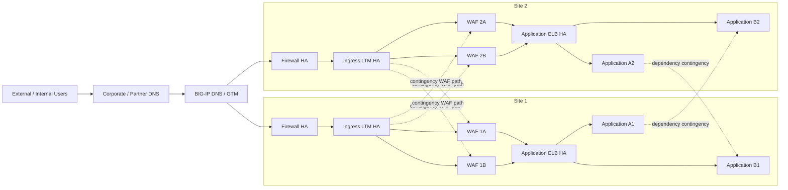

# Enterprise WAF Architecture Options and Cross-Site Resilience

## Purpose

This page compares two WAF deployment models and two routing models for a dual-site enterprise application environment:

1. **Clustered WAFs** versus **LTM load-balanced WAF nodes**.
2. **Local-only routing** versus **controlled cross-site contingency routing**.

It also considers:

- cascading failures between dependent applications;
- internal system-to-system traffic;
- external users arriving over leased lines and VPNs;
- BIG-IP DNS / GTM and LTM responsibilities;
- the impact of active/passive and active/active applications;
- avoiding a site-wide failover because one infrastructure or application component fails.

The design objective is to keep the following as **separate failure domains** wherever possible:

- external connectivity;
- firewall tier;
- ingress LTM tier (Design B);
- WAF tier;
- application ELB tier;
- individual application;
- application dependency;
- inter-site network;
- full site.

A failure in one domain should not automatically force all applications in the site to fail over.

---

# 1. Executive recommendation

Two supported designs are compared. **Design A:** site external VIP on a WAF active/standby cluster -> on-premises application ELB. **Design B:** site external VIP on an ingress LTM HA pair -> independently active WAF nodes -> the same application ELB. Each site has its own GTM/DNS service and ingress path. In Design B, the LTM-balanced WAF pool is the preferred strategic option **if** through-path monitoring, independent node capacity, symmetry, policy consistency and application reconnect requirements are met. Design A is a valid simpler ingress option where its HA, mirroring and shared failure-domain limitations are acceptable.

For cross-site resilience:

> **Keep traffic local during normal operation, but provide tightly controlled cross-site contingency routes for WAF capacity and application dependencies.**

Cross-site capability should be treated as a **recovery path**, not a normal dependency. Loss of the inter-site path should therefore remove contingency options but should **not** interrupt applications whose local components remain healthy.

Recommended high-level topology for **Design B only** (Design A is specified in Section 2.4):



The dashed paths should be explicitly controlled, monitored and normally unused unless required.

---

# 2. Clustered WAF versus LTM load-balanced WAF

## 2.1 Clustered WAF model

Typical local design:

```text
Ingress / site firewall HA
        |
 External VIP: WAF HA cluster
        |
 Internal VIP: application ELB
        |
 VM or Kubernetes application
```

The WAF cluster owns the **site external application VIP** and performs node failover. Design A has **no separate ingress LTM** in front of the WAF. Its backend next hop is the on-premises application ELB internal VIP. One failed cluster member may preserve some connections only when the exact F5 version, license, profiles and mirroring configuration support it; the application must still reconnect.

### Advantages

- Mature and familiar BIG-IP HA model.
- WAF service IP can remain stable during a member failure.
- Configuration and failover state can be tightly integrated.
- Connection/session state can potentially be preserved better where supported and configured.
- Simple upstream routing because the WAF pair appears as one logical service.

### Disadvantages

- In active/standby mode, a significant portion of appliance capacity is normally unused.
- The WAF cluster becomes its own HA dependency and shared failure/change domain.
- A configuration problem can be synchronised across both members.
- Capacity scaling is less natural than simply adding another member to an LTM pool.
- Maintenance often requires explicit HA operations and traffic-group awareness.
- If the whole clustered service becomes unavailable, recovery still requires another local WAF service, cross-site capacity or application/site failover.

---

## 2.2 LTM load-balanced WAF model

Preferred model when a separate ingress LTM HA pair is available:

```text
                 +--> WAF-1A --+
Ingress LTM HA --+             +--> Application ELB --> App
                 +--> WAF-1B --+
```

Both WAFs can be active traffic-processing nodes. The ingress LTM performs health monitoring, load balancing and node withdrawal.

### Advantages

- Both WAF appliances contribute usable capacity.
- Failure of one WAF is handled as a pool-member failure rather than an HA traffic-group event.
- Easier scale-out: add WAF-1C or WAF-1D as pool members.
- Easier maintenance: disable/drain one node, patch it, test it, then return it to service.
- Per-application or per-service health checks can be used instead of one global WAF health state.
- Lower risk that a single WAF appliance failure causes broad application failover.
- Remote WAF nodes can be introduced as lower-priority contingency members where routing permits.

### Disadvantages / design considerations

- Connections currently anchored to a failed WAF may reset and need retry.
- WAF policies and supporting configuration must still be kept consistent across nodes.
- Features with local runtime state, learning, bot state, DoS state, persistence or rate limiting must be validated for multi-node behaviour.
- Return-path symmetry must be maintained through the selected WAF.
- The ingress LTM tier becomes an important dependency and must itself be highly available.

F5 documents BIG-IP pools, health monitors and priority-group activation as core LTM functions. F5 also documents off-box Advanced WAF as a separate inspection service for scale and flexibility. F5 supports synchronising Application Security policies across devices through Sync-Only device groups. See references at the end of this page.

---

## 2.3 Comparison table

| Design area | Clustered WAF | LTM load-balanced WAF |
|---|---|---|
| Normal dataplane | Usually one logical clustered service | Multiple simultaneously active pool members |
| Capacity utilisation | Lower in active/standby mode | Higher; all healthy nodes can carry traffic |
| Node failure action | WAF HA failover | Ingress LTM removes failed pool member |
| Single WAF failure blast radius | Normally low | Normally low |
| Whole local WAF tier failure | Requires a separately engineered alternate ingress or reachable other-site external VIP | Requires a pre-approved, healthy remote WAF pool or other-site external VIP; no local WAF remains |
| Horizontal scaling | Moderate complexity | Simple pool expansion |
| Maintenance | HA-oriented drain/failover | Pool-member drain/disable |
| Config consistency | Native HA/config sync | Requires Sync-Only/config automation discipline |
| Connection preservation | Best effort for a supported, configured single member failover; never a guarantee across other faults | Failed-node connections generally reset; reconnect through surviving pool members |
| Per-app health isolation | Possible but less natural if WAF exposed as one service | Strong; LTM pools/monitors can be app-specific |
| Cross-site capacity borrowing | Requires explicit alternate VIP/routing or separate steering; the WAF cluster cannot transparently borrow a remote member | Can configure remote pool members as lower priority if the full symmetric route and capacity are verified |
| Operational model | Appliance/cluster centric | Service/pool centric |

### Preferred conclusion

If the ingress LTM tier already exists and can balance WAF traffic, **LTM-balanced active WAF nodes are generally the stronger enterprise service model** when the application can reconnect and recover business state. A WAF cluster without ingress LTM is a valid simpler model, but its HA pair and ingress VIP are a shared local failure domain. Neither topology promises survival of a live WebSocket through every fault.

This does **not** mean the WAFs should be unmanaged standalone appliances. WAF policy and security configuration should still be synchronised or centrally deployed.

---

## 2.4 Explicit end-to-end topology and ownership

Assumption for analysis: **two firewall HA pairs total, one pair per site**, with four ingress circuits across the client/site access design. If the actual firewall pairs or circuits are distributed differently, remap the access-failure rows in Section 16A before approving a recovery objective. Each site has a GTM/BIG-IP DNS instance or service; the client uses its own recursive DNS infrastructure. Site 2 is the passive *application* site unless a specific application is declared active/active. A passive WAF/firewall/ELB can be reachable while the application is not ready; do not advertise an unready site.

```text
External user / browser -> client DNS resolver -> client firewall/proxy -> private circuits/VPN
  -> enterprise circuit termination -> site firewall HA pair -> site external VIP

Design A external VIP = clustered active/standby WAF -> application ELB internal VIP
Design B external VIP = ingress LTM HA -> independent WAF node pool -> application ELB internal VIP

Application ELB -> DCS (Huawei VMware VM pool) or HCS (Huawei private cloud VM pool
                 or HCS Kubernetes LB/ingress -> Services/Pods)
```

The two GTM services publish the healthy, **client-reachable external VIP** for each application and cooperate according to their DNS configuration. GTM monitors the effective application path, not just an appliance address. DNS queries may be cached by client resolvers; GTM does not move an established TCP flow. The site external VIP and application ELB internal VIP are separate addresses and separate health domains. Confirm whether four circuits are independent by route, provider, firewall pair and site; four labels alone do not establish independence.

An on-premises application ELB may operate as **L3/L4 forwarding or TCP/TLS pass-through** (choose a backend using flow state; preserve the selected backend for the flow), or as an **L7 proxy** (terminate and establish a new HTTP/TLS connection, route by host/path, and explicitly support WebSocket upgrade and long-lived connections). Pure IP routing at L3 is not application load balancing; specify the real device mode. In either case record the TLS/mTLS termination and re-encryption points, certificates, trusted original-client identity, NAT/SNAT, symmetric return path, persistence if used, health checks, idle/maximum connection age and drain behavior. A passthrough ELB cannot inspect HTTP paths it cannot decrypt; a terminating ELB adds its own timeout, header, authentication and WebSocket support requirements. For Kubernetes, include both the ELB and the HCS ingress/Service hop; for DCS/HCS VMs, include the VM pool and guest process health.

**Cross-site routing is optional contingency, not automatic.** Design B can put a remote WAF behind an ingress LTM as a lower-priority member only when the route through both stateful firewall tiers and back to that same ingress is approved and tested. Design A needs a separate alternate ingress/VIP or reachable other-site VIP; a two-node local cluster alone cannot select an arbitrary remote WAF. In both designs, remote WAF use and application-site failover are distinct operations, and each must pass application-specific health and capacity gates.

## 2.5 Additional operational trade-offs

| Decision factor | A: WAF HA owns external VIP | B: LTM HA VIP -> independent WAFs |
|---|---|---|
| Local failed member | WAF cluster elects peer; floating address/routing and optional supported state mirroring must converge | LTM removes only the failed WAF member; clients on it reconnect through a healthy node |
| Complete local WAF failure | External VIP/path is lost until separately designed ingress or site steering works | External LTM VIP may stay up but **must** be marked application-unavailable without a healthy local/approved remote WAF |
| Complete ingress-device failure | Cluster failure removes external VIP | Complete LTM HA failure removes external VIP even if WAFs are healthy |
| Existing HTTP / WebSocket | In-flight HTTP may fail; a WebSocket is preserved only for a verified supported mirror event | Failed WAF or LTM path loses in-flight HTTP and established sockets; surviving WAFs accept new connections |
| Spare capacity | Standby normally idle; verify it can handle full load after failover | Each remaining WAF and LTM peer needs headroom; connection-count balance differs from request-rate balance |
| Shared configuration errors | HA/config sync can propagate bad policy to both WAFs | Automation/Sync-Only can propagate bad policy to all WAFs; LTM rules add a separate change surface |
| Runtime inspection state | Some state may mirror with vendor/version limitations; test bot, rate-limit, persistence and WAF state | Per-node learning/rate-limit/bot state can diverge; externalize/coordinate if policy requires a global view |
| Health and isolation | Cluster service VIP may conceal one broken application unless per-app service checks are built | Per-app through-WAF pool monitors are feasible but false positives, monitor load and recovery flapping require tuning |
| Return path / identity | Floating IP, routes, NAT and mirrored state need symmetric failover | Both LTM-to-WAF and WAF-to-ELB return paths must stay on selected nodes; SNAT obscures client identity without trusted propagation |
| Maintenance and full tier loss | Plan failover/failback and a separate site/ingress exit | Drain members individually, then whole pool; LTM HA itself is an added planned-change/failure domain |
| Cross-site WAF contingency | Requires explicit alternate ingress/steering beyond the local WAF cluster | Lower-priority remote WAF members possible only with tested inter-site routing, firewall policy and capacity |
| ELB mode / backends | Both models need backend ELB HA and DCS/HCS or Kubernetes readiness | Same; L7 ELB adds a proxy hop, L3/L4 pass-through exposes backend connection behavior |

F5 documents [connection-mirroring limitations](https://techdocs.f5.com/en-us/bigip-17-0-0/big-ip-asm-implementations/connection-mirroring-with-asm/connection-mirroring-limitations.html), including no failback preservation and profile/license restrictions; [LTM pool member handling](https://techdocs.f5.com/en-us/bigip-14-1-0/big-ip-local-traffic-management-basics-14-1-0/about-pools.html) supports member health, priority, connection limits and draining. Apply exact product/release configuration and test the actual live WebSocket behavior.

---

# 3. Local-only routing versus cross-site contingency routing

## 3.1 Local-only model

```text
Site 1 client -> Site 1 LTM -> Site 1 WAF -> Site 1 Application
Site 2 client -> Site 2 LTM -> Site 2 WAF -> Site 2 Application
```

There is no supported route from Site 1 WAF/LTM to Site 2 application infrastructure, or vice versa.

### Advantages

- Simpler routing and security policy.
- Easier traffic-flow troubleshooting.
- Reduced asymmetric routing risk.
- Inter-site network is not part of normal application delivery.
- Clear site boundary and simpler firewall rule base.

### Disadvantages

- Spare WAF capacity in the other site cannot protect a healthy local application.
- Local WAF-tier failure can force an application or full service to the other site even when the application itself remains healthy.
- A local dependency failure can force dependent applications to move sites.
- Planned maintenance can have a larger impact because there are fewer recovery choices.
- The design creates stronger coupling between infrastructure failure and application disaster recovery.

---

## 3.2 Controlled cross-site contingency model

Normal traffic remains local. The following ingress LTM and remote-WAF examples apply to **Design B**; Design A needs its separately engineered alternate ingress path:

```text
Site 1 ingress LTM -> Site 1 WAF -> Site 1 application ELB -> Site 1 App
```

Contingency paths are additionally available:

```text
Site 1 ingress LTM -> Site 2 WAF -> Site 1 App ELB -> Site 1 App

or

Site 2 ingress LTM -> Site 2 WAF -> Site 1 App ELB -> Site 1 App
```

For internal dependencies:

```text
App A1 -> local Service-B LTM VIP -> B1 normally
                                 -> B2 on contingency
```

### Advantages

- WAF capacity can be borrowed across sites.
- A WAF-tier failure does not necessarily cause application failover.
- A dependent service can move sites without moving every application that uses it.
- Site failover can remain the final recovery step rather than the first recovery step.
- Maintenance can be performed with lower risk.
- Better use of otherwise idle DR capacity.

### Disadvantages

- Requires controlled inter-site routes and firewall policy.
- Requires deterministic return-path symmetry.
- Cross-site throughput must support contingency load.
- Monitoring must distinguish local service health from remote-path health.
- Troubleshooting becomes more complex because ingress site, WAF site and application site can differ.
- Cross-site traffic can create a trombone path and additional bandwidth consumption.

---

## 3.3 Recommended cross-site policy

Do **not** make the sites generally routable to each other.

Use explicit service flows such as:

```text
Site1-Ingress-LTM -> Site2-WAF-Pool : application HTTPS flows only
Site2-Ingress-LTM -> Site1-WAF-Pool : application HTTPS flows only
Site1-WAF         -> Site2-App-LTM  : approved backend VIPs only
Site2-WAF         -> Site1-App-LTM  : approved backend VIPs only
App-A1            -> Site2-B-VIP    : required application protocol only
App-A2            -> Site1-B-VIP    : required application protocol only
```

Default deny all unrelated inter-site application traffic.

The remote members should normally be configured as **lower-priority / contingency resources**, not as equal active members, unless the application is explicitly designed for active/active cross-site operation.

F5 LTM Priority Group Activation is directly useful for this pattern: higher-priority local members can receive traffic while they are healthy, with lower-priority remote members becoming eligible only when local capacity falls below the configured threshold.

---

# 4. Why cross-site routing reduces cascading failures

Consider App A in Site 1 depending on App B in Site 1.

## 4.1 Without cross-site routing

```text
A1 ---> B1
        X failure
```

If B1 fails and A1 has no route to B2:

```text
B1 failure
   |
   v
A1 loses dependency
   |
   v
A1 degraded/unavailable
   |
   v
Fail App A to Site 2
   |
   v
A2 -> B2
```

A failure of **App B** has now caused a failover of **App A**.

If C, D and E also depend on B, they may all need to fail over as well.

That is a cascading failure.

### Example cascade

```text
             B1 failure
                 |
      +----------+----------+
      |          |          |
     A1         C1         D1
      |          |          |
      v          v          v
   fail A     fail C     fail D
      \          |          /
       +---------+---------+
                 |
          Site 2 capacity spike
```

A small failure can therefore become a site-level event.

---

## 4.2 With cross-site contingency routing

```text
A1 ---> Service-B VIP
           |      \
           |       +====> B2 contingency
           v
          B1 preferred
```

When B1 fails:

```text
A1 -> Site1 LTM Service-B VIP -> B2
```

App A remains in Site 1.

Only the failed dependency moves.

This is normally a much smaller and more controlled failure domain.

---

# 5. Behaviour when the cross-site network fails

Cross-site routing should be a **resilience enhancement**, not a prerequisite for healthy local traffic.

Required behaviour:

| Condition | Expected result |
|---|---|
| Local A1 and B1 healthy; cross-site route lost | No application impact |
| Local WAF pool healthy; cross-site route lost | No user impact |
| A1 healthy, B1 failed, B2 healthy, cross-site available | A1 uses B2 |
| A1 healthy, B1 failed, cross-site unavailable | A1 becomes degraded/unavailable unless another local recovery exists |
| Local WAF tier failed, remote WAF available, cross-site available | Use remote WAF contingency path |
| Local WAF tier failed and cross-site unavailable | External service must use alternate ingress/site or application failover |
| Application currently using remote WAF and cross-site fails | Existing cross-site sessions fail; route back to local WAF if available or steer service to alternate site |

The critical rule is:

> **Loss of cross-site routing must not mark the whole local site unavailable if local application paths remain healthy.**

Do not configure a site-health expression equivalent to:

```text
SITE1_UP = APP_A AND APP_B AND APP_C AND CROSS_SITE_LINK
```

Instead use application/service-specific health conditions.

---

# 6. Internal system-to-system traffic

Internal system flows need separate design treatment from external user ingress.

Assume:

```text
Application A -> Application B
```

There are three main models.

## 6.1 Model 1 - hard-coded local endpoint

```text
A1 -> B1-IP
```

This should be avoided where resilience is required.

If B1 fails, A1 has no automatic alternative.

---

## 6.2 Model 2 - DNS / GTM-based service selection

```text
A1 -> b.internal.example
          |
          v
      BIG-IP DNS/GTM
        /        \
      B1          B2
```

### Advantages

- Can steer service calls between sites.
- Fits applications that already use DNS-based discovery.
- BIG-IP DNS can use health information from LTM systems.

### Limitations

- Applications may cache DNS responses.
- JVMs, application frameworks, proxies and connection pools may retain addresses for much longer than DNS TTL suggests.
- Existing persistent TCP/TLS sessions do not move because DNS changed.
- Convergence therefore depends on both DNS and the application's retry/re-resolution behaviour.

For internal east-west traffic, GTM should not automatically be assumed to provide rapid failover.

---

## 6.3 Model 3 - local LTM service VIP with remote fallback

Recommended where technically possible:

```text
A1
 |
 v
Site1 LTM VIP: B-Service
 |
 +--> B1   Priority 10 / preferred
 |
 +==> B2   Priority 5 / contingency
```

This gives the local LTM direct control over dependency failover.

### Benefits

- No dependency on DNS cache expiration for B1 -> B2 failover.
- A1 continues using one stable service address.
- Local service remains preferred.
- Remote service can be withdrawn immediately when the inter-site path fails.
- Failure of B does not automatically require failure of A.

### Requirement

A1 must be able to route to the Site 1 service VIP, and the Site 1 LTM must have an approved route from the service pool to B2 through the inter-site network.

---

# 7. DNS / GTM requirements

## 7.1 External user DNS

BIG-IP DNS / GTM should select **site external application VIPs**: the WAF cluster VIP in Design A or the ingress LTM VIP in Design B. It should not select individual active WAF pool members.

```text
app.example.com -> client recursive DNS -> GTM at each site
                                   /                     \
                     Site1 external VIP            Site2 external VIP
                     A: WAF / B: LTM             A: WAF / B: LTM
```

GTM should have application-specific health rather than one blanket site health state.

For example:

```text
APP-A-SITE1-AVAILABLE
APP-A-SITE2-AVAILABLE
APP-B-SITE1-AVAILABLE
APP-B-SITE2-AVAILABLE
```

A failure of App B must not cause GTM to remove App A from the site unless A truly cannot provide service.

F5 documents BIG-IP DNS integration with LTM using iQuery/big3d so DNS can obtain virtual-server status and network-path information from BIG-IP systems.

---

## 7.2 Internal user DNS

Internal users may use:

- corporate recursive DNS;
- conditional forwarding or delegation to BIG-IP DNS for selected application zones;
- split DNS where internal users receive internal VIPs and external/partner users receive different VIPs.

The DNS design should preserve the distinction between:

```text
External client service VIP
Internal user service VIP
System-to-system service VIP
```

These do not have to resolve to the same destination.

---

## 7.3 System-to-system DNS

Where system-to-system flows use an LTM service VIP, DNS can remain simple:

```text
b.service.internal -> Site1 B-service VIP
```

The LTM then chooses B1 or B2 based on health and priority.

This is often preferable to making GTM responsible for every service dependency.

GTM remains valuable where:

- the calling application can exist in either site;
- different callers must receive different site-local service VIPs;
- an application is genuinely active/active;
- there is no suitable local LTM service abstraction;
- DNS-based site selection is already part of the application design.

---

# 8. External leased-line and VPN users

External users are constrained by **network reachability before DNS or WAF logic matters**.

GTM can return Site 2, but the client still requires a valid network path to Site 2.

Therefore:

> **DNS/GTM does not solve a leased-line routing limitation.**

## 8.1 Leased-line users

Assume four separate client connectivity pools and four firewall appliances arranged as two HA firewall pairs. The exact pool-to-firewall mapping should be confirmed.

Questions that must be answered for each client pool:

1. Can the client route to both Site 1 and Site 2 ingress VIPs?
2. Does the leased-line provider advertise both site prefixes?
3. Can the client fail between sites automatically, or is a routing change required?
4. Does the client's DNS resolver honour the GTM answer and TTL?
5. Does the client's firewall permit both site VIP ranges?
6. Is source-address preservation required end-to-end?

If a leased-line pool can reach only Site 1, then this will not work:

```text
GTM -> Site2 VIP
```

for that client.

Instead, Site 1 may need to remain the ingress point while Site 1 LTM uses remote WAF capacity or remote application services behind the scenes:

```text
Client leased line
      |
 Site1 firewall
      |
 Site1 ingress LTM
      |
      +====> Site2 WAF contingency
                 |
                 +====> Site1 application
```

This is one of the strongest reasons to retain selective cross-site infrastructure routing even when external clients themselves cannot route cross-site.

---

## 8.2 VPN users

VPN users are often more flexible if the VPN design can advertise or route both site service networks.

Possible recovery:

```text
VPN user -> GTM -> Site2 ingress -> Site2 WAF -> Site2 App
```

or, where the application remains active in Site 1:

```text
VPN user -> Site2 ingress -> Site2 WAF -> Site1 App
```

The second option allows the WAF/ingress service to move without moving application processing, if the Site 2 WAF-to-Site 1 ELB path is approved and symmetric.

---

# 9. The 25% user-impact rule

If the operating requirement is that trading/service may remain open only while **less than 25% of users are affected**, client access failure domains need to be modelled explicitly.

If four connectivity pools are equal in size:

```text
Pool 1 = 25%
Pool 2 = 25%
Pool 3 = 25%
Pool 4 = 25%
```

then loss of one entire pool affects **25%**, which does not satisfy a strict requirement of **<25%**.

If two pools share one firewall HA pair, complete failure of that firewall pair could potentially affect approximately **50%** of clients, depending on the actual routing and client distribution.

The availability requirement should therefore be expressed as:

> **No single infrastructure failure should make 25% or more of eligible users unable to reach the service**, if the rule is strictly `<25%`.

Possible mitigations include:

- alternate route from each client pool to another firewall/site;
- dual-site route advertisement;
- VPN fallback for leased-line clients;
- redistributing users so no access failure domain reaches the threshold;
- additional firewall/access domains;
- documented interpretation of whether the requirement is `<25%` or `<=25%`.

---

# 10. Cascading-failure examples

| Failure | No cross-site route | Cross-site contingency available |
|---|---|---|
| One WAF node fails | Cluster/LTM local recovery | Same; local recovery |
| Entire local WAF tier fails | App/service may have to move site | Remote WAF can protect healthy local app |
| B1 fails, A1 depends on B | A1 degrades or A must fail to Site 2 | A1 can use B2 |
| Shared B1 used by A/C/D | Several apps may fail over | Only B dependency crosses sites |
| App A1 fails | A fails to A2 | Same; A only |
| Cross-site route fails while all local services healthy | No impact if design is local-only | No impact; contingency capability is lost only |
| Cross-site route fails while A1 is using B2 | Not applicable | A loses remote dependency unless B1 recovers |
| Cross-site route fails while Site1 uses Site2 WAF | Not applicable | Those sessions fail/re-route; other local services remain local |
| Site1 ingress LTM fails | Site/site-ingress failover required | GTM or alternate ingress required |
| One leased-line pool fails | Affected clients lose service unless alternate path | Same unless client has alternate path/VPN |

The objective is to prevent this pattern:

```text
one component failure
        |
        v
one application fails
        |
        v
dependent applications fail
        |
        v
whole site evacuated
        |
        v
secondary-site capacity spike
```

---

# 11. Health-monitoring model

Health monitoring should occur at several layers.

## Ingress LTM -> WAF (Design B); WAF cluster -> ELB (Design A)

Check more than simple TCP reachability where possible. Design A needs equivalent per-application through-path checks from the WAF cluster external VIP to the application ELB/backends.

F5 supports **transparent monitors**, where an LTM monitor can send a probe through a pool member such as a firewall/security device to an aliased destination beyond it. This is useful to detect a WAF that is alive but cannot correctly forward the protected application path.

Example:

```text
Ingress LTM monitor
       |
       v
      WAF1
       |
       v
Application health endpoint
```

## Application ELB -> DCS/HCS VMs or HCS Kubernetes ingress

Use service-specific HTTP/HTTPS or protocol health checks. If the ELB forwards at L3/L4, health-check application readiness separately from a reachable IP/port; if it terminates at L7, test its proxy behavior, WebSocket upgrade and backend response.

## Cross-site service member

A remote member should be considered available only when:

```text
Remote member healthy
AND
cross-site route healthy
AND
required firewall policy/path healthy
```

## GTM / BIG-IP DNS

GTM should evaluate the service presented by the site ingress LTM and application-specific availability, not merely whether the site or appliance responds to ping.

---

# 12. Routing and traffic-symmetry requirements

Cross-site WAF use can create asymmetric routing if not deliberately designed.

Bad example:

```text
Client -> Site1 LTM -> Site2 WAF -> Site1 App
Site1 App -> Site1 firewall -> Client
```

The response bypasses the WAF that owns the TCP/security state.

Preferred model:

```text
Client
  |
Site1 ingress LTM
  |
Site2 WAF
  |
Site1 App ELB / App
  |
Site2 WAF
  |
Site1 ingress LTM
  |
Client
```

SNAT, route domains, policy routing or another deterministic routing technique may be required to preserve symmetry.

If SNAT is used, preserve trusted original-client information at the application layer where required and ensure external clients cannot spoof trusted forwarding headers.

---

# 13. Active/passive applications

Many applications are active in Site 1 with Site 2 manually started only during DR.

For these applications, remote resources must not be selected simply because they exist in configuration.

Example:

```text
A1 = running / preferred
A2 = administratively unavailable or health-check down
```

When DR is declared:

```text
1. Start A2.
2. Validate application dependencies.
3. Health checks mark A2 available.
4. GTM/LTM makes A2 eligible.
5. Shift traffic according to the runbook.
```

Cross-site WAF capacity can still be useful while A1 remains active.

This allows recovery from a WAF failure without initiating full application DR.

---

# 14. Active/active applications

For applications designed for active/active operation:

- GTM may return both site ingress VIPs.
- Both WAF pools can carry normal traffic.
- Application state/session consistency must be supported across sites.
- Dependency routing may prefer local services while permitting remote services.
- Cross-site link capacity becomes more operationally significant because remote flows may be normal rather than exceptional.

Active/active application design does not automatically mean WAFs should be cross-site active for every flow. Local WAF processing should still normally be preferred to reduce inter-site dependency and bandwidth use.

---

# 15. Architecture option summary

| Option | WAF design | Cross-site routing | Resilience | Complexity | Capacity efficiency | Cascading-failure control | Assessment |
|---|---|---|---|---|---|---|---|
| A | Clustered WAF | None | Good for node failure | Low | Low/Medium | Weak for dependency failures | Baseline |
| B | LTM-balanced WAF | None | Strong local WAF resilience | Medium | High | Weak for cross-site dependencies | Good local design |
| C | Clustered WAF | Controlled contingency | Strong | Medium/High | Medium | Strong | Viable |
| D | **LTM-balanced WAF** | **Controlled contingency** | **Strongest** | High | **High** | **Strongest** | **Preferred strategic model** |

---

# 16. Recommended target behaviour by failure type

The recovery order should be:

```text
1. Recover within the application instance pool and local ELB.
2. Recover within the local firewall HA pair and WAF HA pair (A) or LTM HA/WAF pool (B).
3. Use an engineered alternate WAF/ingress or cross-site service/dependency path.
4. Fail over only the affected application when its standby is ready.
5. Evacuate the site only for a genuine site-level failure.
```

Every step restores **new transactions/connections**; existing WebSockets may be lost at any of these boundaries.

This prevents infrastructure faults from being automatically promoted into application DR events.

Recommended architecture requirements:

> **R1. Failure of a single WAF node SHALL NOT cause application site failover while another approved WAF path remains available.**

> **R2. Failure of one application SHALL NOT cause unrelated applications to fail over.**

> **R3. Failure of a local application dependency SHALL NOT cause the calling application to move sites when an approved healthy remote dependency is available.**

> **R4. Loss of cross-site connectivity SHALL remove cross-site contingency paths but SHALL NOT mark otherwise healthy local application services unavailable.**

> **R5. GTM health and steering SHALL be application/service-specific rather than based on a single aggregate site-health state.**

> **R6. External user failover SHALL consider actual leased-line/VPN reachability; DNS steering SHALL NOT assume a client can route to both sites.**

> **R7. Cross-site flows SHALL be allow-listed by source tier, destination VIP/service and protocol; unrestricted inter-site application routing SHALL NOT be required.**

> **R8. Applications SHALL recover HTTP transactions and WebSockets according to their distinct semantics: retry only safe/idempotent HTTP operations automatically; reconnect WebSockets with bounded backoff/jitter, reauthenticate, resubscribe and replay or reconcile missed state.**

> **R9. Every retryable business write SHALL have an operation/client-order key and an authoritative outcome lookup; a lost HTTP response or WebSocket acknowledgement SHALL NOT be interpreted as failure of the business operation.**

> **R10. Each site/application SHALL expose a health signal reflecting the complete approved ingress-to-backend path and identity/state readiness. A passive site SHALL NOT be advertised merely because a firewall, WAF or ELB VIP responds.**

> **R11. Both ELB modes SHALL specify TLS/mTLS boundaries, trusted client identity, health, draining, timeouts and WebSocket upgrade handling. Persistent connections SHALL be tested at every L3/L4 or L7 hop.**

---

# 16A. End-to-end failure analysis for Designs A and B

## 16A.1 Interpretation and recovery-time model

Each row considers one fault unless stated otherwise. **A** is the active/standby WAF cluster owning the site external VIP; **B** is the LTM HA owning that VIP and balancing independent WAFs. A healthy VIP does not prove application readiness. HTTP means in-flight and new requests; WS means an established WebSocket and its logical state. An established connection through a failed stateful hop is presumed lost unless exact connection mirroring has passed live tests. Health withdrawal protects new flows, not a lost transaction.

Recovery is a measured chain: `T_detect` (health/heartbeat), `T_path` (HA/routing/pool convergence), `T_DNS` (authoritative change, recursive/client cache and re-resolution if changing sites), `T_retry` (HTTP retry or WS backoff), `T_auth` (session/token), `T_restore` (subscription, replay/snapshot and business reconciliation), and `T_ready` (passive app/data readiness). User-visible recovery is the sum of applicable **sequential** terms; measure overlapping terms rather than double-counting. These columns identify time drivers, **not promised seconds**. Per-app p95/p99 targets require live testing from each client pool. Manual DR or an unreachable alternate site has no bounded recovery time.

| Recovery class | Time drivers and expected boundary |
|---|---|
| Local member/HA | `T_detect + T_path + T_retry + T_auth + T_restore` for affected connections. Unaffected existing flows can continue. |
| Other ingress/site | Local terms plus `T_DNS`, verified client reachability and possibly `T_ready`; DNS TTL alone does not bound client convergence. |
| Shared state/data loss | `T_auth/T_restore/T_ready` include storage, replication and authoritative business recovery; no safe service while the authority is absent. |

**Proposed planning bands for acceptance tests (not measured predictions):** `R0` = no user-visible interruption for an unaffected flow; `R1` = automated local-path recovery target **≤2 minutes p95** for an affected client; `R2` = alternate-ingress/site target **≤15 minutes p95**, only if the passive application and data are already ready and the client can route to its VIP; `R3` = dependency, manual DR or no alternate path, **no defensible upper bound** until an application-specific RTO/runbook is agreed. A critical trading application may require much tighter values. Measure p99 and the slowest client pool separately. Time spent reconciling a business write counts as recovery even after an HTTP 200 or WS handshake succeeds.

## 16A.2 Client, DNS, circuits and firewalls

| Failure / scope | A: WAF cluster VIP | B: LTM VIP + WAF pool | HTTP outcome | Existing WebSocket and recovery | Recovery-time drivers / checks |
|---|---|---|---|---|---|
| Client tab/device sleeps, reboots or changes network | Site path intact | Same | In-flight request can fail or have unknown write outcome; query authoritative result | Socket resets/stalls; heartbeat, reconnect, reauth, replay/snapshot | Client return + `T_retry/T_auth/T_restore`; persist cursor beyond page life as needed **[R1]** |
| Client recursive DNS or forwarding node fails | Existing flow unaffected | Same | Cached VIP may work; uncached lookups fail until alternate resolver | Existing socket survives until path fault; reconnect may lack resolution | Resolver redundancy, cache/negative TTL and `T_DNS` **[R1]** |
| One GTM/DNS site node fails, other answers | Existing flow unaffected | Same | New lookups should use surviving authority | Established sockets unaffected | Delegation/resolver failover and `T_DNS` **[R0/R1]** |
| Both GTM authorities or DNS delegation fail | Cached VIP may still work; no reliable DNS steering | Same | New clients without cache cannot resolve | Existing sockets survive while path does; recovery after another fault blocked | Repair DNS/authority; site failover cannot rely on unavailable DNS **[R3]** |
| Client firewall/proxy HA member fails or state ages out | VIP stays healthy | Same | Request may reset or silently stall; retry only if safe | Socket resets/stalls; reconnect when path returns | Client HA/state/NAT, idle/absolute age, heartbeat deadline **[R1]** |
| Whole client firewall pair/proxy tier fails | Affected users cannot reach either VIP unless alternate | Same | Unavailable for affected pool | All affected sockets lost | Alternate client network/VPN; unbounded without one **[R3]** |
| One of four circuits/VPN tunnels fails | Cluster VIP reachable only through permitted alternate | Same | In-flight request can fail; new connection after routing converges | Route/NAT changes can break socket; reconnect | Route failover + retry; map user share per circuit and 25% rule **[R1/R2]** |
| All circuits to active site or common carrier fails | Other-site WAF VIP only if reachable/ready | Other-site LTM VIP only if reachable/ready | New requests depend on route, DNS and app readiness | All sockets on path lost; recover at other site | `T_DNS/T_ready/T_retry/T_restore`; circuit count does not prove independence **[R2/R3]** |
| One enterprise firewall appliance in a site's HA pair fails | Cluster VIP can remain | LTM VIP can remain | In-flight request may fail despite stable VIP | Assume loss unless firewall state/NAT survival tested | Firewall HA/state and symmetric route + retry **[R1]** |
| Both enterprise firewall peers or entire pair fail | Site VIP unreachable; alternate site/ingress | Same | Local new requests fail until external alternate | All sockets through pair lost | `T_detect/T_DNS`, client route; WAF/LTM HA cannot fix upstream loss **[R2/R3]** |
| Shared firewall policy/NAT error or asymmetric return | WAF cluster can show green falsely | LTM pool can show green falsely | Requests blocked/blackholed | Reconnect loop or silent stall | Through-path checks, NAT ownership, rollback; potentially manual **[R3]** |

## 16A.3 Ingress, WAF and application ELB

| Failure / scope | A: WAF cluster VIP | B: LTM VIP + WAF pool | HTTP outcome | Existing WebSocket and recovery | Recovery-time drivers / checks |
|---|---|---|---|---|---|
| One WAF appliance/process fails abruptly | HA peer takes floating VIP if healthy | LTM withdraws failed pool member | Requests on failed node may fail or have ambiguous commit; safe retry/lookup | A mirror may preserve a supported flow, otherwise reconnect; B sockets on failed node reconnect | A: HA/floating route; B: monitor/pool withdrawal; plus `T_retry/T_restore` **[R1]** |
| WAF standby unavailable before active fails / one WAF remains | One more failure removes external VIP | Remaining B WAF has no local spare | Service is degraded; avoid accepting beyond capacity | Surviving sockets continue; next failure forces alternate path | Alert on last-member and load; capacity gate **[R0 (degraded)]** |
| Whole local WAF HA pair / all B WAF nodes fail | External VIP lost; explicit alternate ingress/other site required | LTM VIP can answer but must withdraw app if no approved WAF | Requests fail locally until secure alternative | All local WAF sockets lost; reconnect via approved remote/site path | `T_detect/T_path` plus `T_DNS/T_ready` if site changes; never bypass WAF **[R2/R3]** |
| WAF split-brain, bad shared policy/cert/license | Both HA peers can fail together | Config automation can break all independent WAFs | Handshake/inspection fails | Reconnect retries repeat failure | Config validation/rollback, possible manual recovery **[R3]** |
| Ingress LTM single node fails | No ingress LTM in A | HA peer takes external VIP | B in-flight requests may fail | B sockets on failed LTM presumed lost absent tested mirroring | B HA/floating route + `T_retry/T_restore`, symmetric WAF path **[R1]** |
| Entire ingress LTM HA pair/VIP fails | No LTM failure domain in A | WAF nodes healthy but no local entry; alternate ingress/site | B new requests fail locally | B all ingress sockets lost | `T_detect/T_DNS` + external route/standby readiness **[R2/R3]** |
| Health check falsely green/red | WAF cluster VIP can mask broken app path | LTM can select broken WAF or remove healthy members | False green errors; false red capacity loss | Reconnect loop or unnecessary drop | Through-path, TLS/upgrade, app-specific probes, hysteresis, health logs **[R1/R3]** |
| Application ELB L3/L4 forwarder node fails | WAF remains | LTM/WAF remain | Requests mapped to failed flow may fail; new flow selects healthy ELB | Existing socket through failed stateful node usually reconnects | ELB HA/flow state, NAT, symmetry, `T_retry/T_restore` **[R1]** |
| Application ELB L7 proxy node fails | WAF remains | LTM/WAF remain | Proxied request/response may be ambiguous | Socket on failed proxy lost, reconnect/resubscribe | ELB withdrawal, TLS/header/auth/upgrade config, `T_restore` **[R1]** |
| Whole ELB VIP/service or all ELB nodes fail | WAF must mark app path unavailable | Through-WAF health must withdraw app/site | Backend unavailable until local ELB/approved remote app ready | Sockets lost; local reconnect cannot succeed yet | `T_detect/T_DNS/T_ready`; never route around WAF **[R2/R3]** |
| ELB mode misconfiguration (L3/L4 persistence; L7 upgrade/TLS/timeouts) | WAF may pass health probe while traffic fails | Same | Misdirected or rejected HTTP | Wrong backend state, rejected upgrade or premature close | Mode-specific end-to-end checks, certificate/timeout register, rollback **[R3]** |
| Planned WAF, LTM or ELB drain | A shift WAF VIP after peer validated | B disable WAF member; drain LTM/ELB independently | New requests use healthy paths; long requests need grace | Existing sockets can exceed window; close explicitly and reconnect | Drain budget vs max stream duration, capacity, jitter; test staged maintenance **[R0/R1]** |

## 16A.4 DCS, HCS, Kubernetes, state and site

| Failure / scope | A: WAF cluster VIP | B: LTM VIP + WAF pool | HTTP outcome | Existing WebSocket and recovery | Recovery-time drivers / checks |
|---|---|---|---|---|---|
| One DCS VMware host, VM or app process fails | WAF-to-ELB path intact if other backends ready | Same | ELB withdraws bad VM; in-flight request may fail | Sockets on failed VM lost; reconnect to peer | Host/VM/app health, ELB withdrawal, shared storage/network risk **[R1]** |
| Entire DCS cluster, shared storage/network or all DCS VMs fail | HCS/other site only if separately deployed/ready | Same | No backend until healthy HCS/site target ready | DCS sockets all lost; recover subscriptions/state on alternative | `T_ready` + data consistency; unbounded for DCS-only workload **[R2/R3]** |
| One HCS VM/app process fails | ELB selects healthy HCS/DCS peer if approved | Same | In-flight request may fail, retry/lookup | Socket lost; reconnect | ELB probe + `T_retry/T_restore` **[R1]** |
| Entire HCS compute/network cluster or all HCS VMs fail | DCS/other-site target only if independently ready | Same | No backend without approved alternative | HCS sockets lost | `T_ready` + data/identity; HCS/DCS names do not prove isolation **[R2/R3]** |
| One HCS Kubernetes ingress/LB instance fails | Need healthy ingress replicas | Same | Requests via failed ingress may fail | Pinned sockets lost; reconnect to peer | Ingress HA, upgrade/idle timeouts, `T_restore` **[R1]** |
| Kubernetes Pod crashes/terminates or worker node fails | ELB/ingress selects ready replicas | Same | In-flight request may fail; planned drain helps | Socket lost/cleanly closed; reconnect to another Pod | Readiness, EndpointSlice, termination grace, node scheduling, `T_restore` **[R1]** |
| Entire HCS Kubernetes cluster/control plane/network fails | Other cluster, DCS or site only if ready | Same | No backend unless alternative eligible | Cluster sockets lost | `T_ready`; control-plane failure may leave data-plane Pods running temporarily **[R2/R3]** |
| Authentication/session store, database or event log fails | VIP may be green, application effectively unready | Same | Login/writes fail; ambiguous writes await authoritative lookup | Reconnect/replay may fail; fallback snapshot/dedupe when restored | Stateful HA/replication, `T_auth/T_restore`, recovery point **[R3]** |
| One application or dependency fails; other apps healthy | Preserve healthy site apps | Same | Per-app ELB/GTM route to approved dependency/backend | Affected app sockets lost; state recovery | Service-specific health and `T_ready`; avoid whole-site evacuation **[R1/R2]** |
| Inter-site link/remote path fails; local services healthy | Local cluster continues | Local WAF pool continues; withdraw remote pool | No local impact | Local sockets unaffected | `T_detect`; no remote dependency in local health predicate **[R0]** |
| Inter-site link fails while using remote WAF/app dependency | Alternate ingress/remote route fails; use local path if available | Withdraw remote member; use local path if available | In-flight cross-site request may fail | Cross-site sockets lost; reconnect/reconcile | Route health, symmetry, `T_retry/T_restore`; no cascade **[R1/R2/R3]** |
| Entire active site fails, including GTM, firewall, WAF/LTM, ELB, application | Site 2 WAF VIP only if client-reachable and app/data ready | Site 2 LTM VIP same gates | In-flight requests fail; new ones use reachable ready site | All active-site sockets lost; site 2 surge/replay | `T_detect/T_DNS/T_ready/T_retry/T_auth/T_restore`; manual DR may dominate **[R2/R3]** |
| Both sites or shared PKI/identity/data/policy dependency fail | No independent path | Same | Service unavailable or unsafe | Reconnect cannot restore trust/state | Common-mode remediation; unbounded absent tested degraded mode **[R3]** |
| Reconnect storm after member/tier/site failover | Standby WAF/firewall/ELB must absorb load | Surviving LTM/WAFs/firewall/ELB must absorb load | HTTP retries can exhaust CPU/TLS/ports | TLS, auth, resubscription and replay surge | Size simultaneous sockets **and** new connections/sec; jitter, rate caps, headroom **[R1/R2]** |

F5 [connection mirroring limitations](https://techdocs.f5.com/en-us/bigip-17-0-0/big-ip-asm-implementations/connection-mirroring-with-asm/connection-mirroring-limitations.html) make mirror survival conditional. F5 [pool behavior](https://techdocs.f5.com/en-us/bigip-14-1-0/big-ip-local-traffic-management-basics-14-1-0/about-pools.html) distinguishes a healthy member, a disabled member and active connections. Kubernetes [Pod termination](https://kubernetes.io/docs/concepts/workloads/pods/pod-lifecycle/) marks terminating endpoints unready for normal traffic; remaining connections need explicit drain behavior. These documents provide design evidence, not measured recovery times for this deployment.

## 16A.5 Application requirements and acceptance evidence

**HTTP:** Classify safe reads, idempotent updates and business commands. Bound retries with backoff/jitter. Assign stable operation or client-order IDs to retryable writes and expose an authoritative lookup for ambiguous outcomes. Do not treat a lost HTTP response as proof the write failed. Isolate application-specific health so an unrelated service does not evacuate the site.

**WebSocket:** Detect close and silent stall via a heartbeat deadline; re-resolve where appropriate; reconnect with bounded backoff and jitter; reauthenticate; restore subscriptions; replay from a scoped durable cursor where offered; otherwise load a snapshot and reconcile. Deduplicate events and commands and persist safely processed cursor state when browser/device restarts matter. Mirror features do not replace recovery. See [WebSocket application requirements](./waf_websocket_resilience_cloud_patterns.md#17-minimum-application-requirements-for-resilient-websockets).

Maintain an application register of client populations per circuit/firewall/site; each site VIP and DNS path; A/B topology; TLS/mTLS, identity and NAT boundaries; ELB L3/L4 versus L7 mode; DCS/HCS VM or Kubernetes topology; health and dependency/data authority; every timeout/drain setting; p95/p99 `T_detect/T_path/T_DNS/T_retry/T_auth/T_restore/T_ready`; observed HTTP/WS transaction loss; and load under member, pair, tier and site failures. Include ambiguous writes and events sent just before disconnection in failure tests.

---

# 17. Test scenarios

The architecture should be validated by intentionally injecting the following failures:

1. Failure of one WAF cluster member (A) and one load-balanced WAF node (B).
2. Failure of the complete local WAF HA pair (A) or all local WAF pool nodes (B).
3. WAF process alive but application forwarding broken.
4. Failure of one ingress LTM node.
5. Failure of an ingress LTM HA pair.
6. Failure of one application ELB node.
7. Failure of App A1 only.
8. Failure of App B1 while A1 remains healthy.
9. Failure of B1 when A1, C1 and D1 all depend on B.
10. Failure of Site1 -> Site2 cross-site routing only.
11. Failure of Site2 -> Site1 cross-site routing only.
12. Loss of cross-site routing while remote WAF capacity is in use.
13. Loss of cross-site routing while A1 is using B2.
14. Failure of one leased-line client pool.
15. Failure of one firewall appliance.
16. Failure of one complete firewall HA pair.
17. Failure of one GTM/DNS node.
18. Failure of the full Site 1 ingress path.
19. Full Site 1 loss.
20. Capacity test with one WAF removed and remote contingency activated.
21. Client sleep, network handoff, client DNS failure, client firewall node and whole pair failure.
22. Entire enterprise firewall HA pair failure, all circuits to one site, and shared carrier failure.
23. ELB L3/L4 node and full service failure; separately L7 proxy node and full service failure.
24. DCS host/VM, entire DCS pool/shared storage; HCS VM, full HCS pool, Kubernetes ingress, Pod, node and cluster failure.
25. Authentication/event store outage, stale event cursor, lost write acknowledgement and duplicate command.
26. Full WAF/LTM/ELB cluster failure and passive application not yet ready at the alternate site.
27. Concurrent client reconnect storm and degraded-capacity operation with peak-like traffic.

For each test record:

- detection time;
- routing/LTM/GTM convergence time;
- percentage of users affected;
- new-connection success rate;
- existing-session impact;
- application dependency impact;
- whether cross-site routing was invoked;
- whether manual intervention was required;
- whether any unrelated application failed over;
- p95/p99 HTTP and WebSocket user-visible recovery, lost/duplicate messages and unknown write outcomes;
- recovery-time component measurements and capacity at each surviving member/site.

---

# 18. F5 architecture alignment and references

The architecture above should be described as **aligned with F5-supported architectural capabilities**, rather than as a statement that F5 mandates one exact topology.

F5 documents the following building blocks relevant to this design:

1. **BIG-IP LTM pools and health monitoring** - LTM can associate health monitors with pool members, apply load-balancing algorithms and place pool members into priority groups.  
   https://techdocs.f5.com/kb/en-us/products/big-ip_ltm/manuals/product/ltm-concepts-11-5-1/6.html

2. **Priority Group Activation** - higher-priority pool members can receive traffic first, with lower-priority members becoming active when available members in the preferred group fall below a configured threshold. This maps well to local-first / remote-contingency service design.  
   https://techdocs.f5.com/kb/en-us/products/big-ip_ltm/manuals/product/ltm-concepts-11-5-1/6.html

3. **Transparent health monitoring** - LTM can test an aliased destination through a pool member, commonly a firewall or other inline device, and mark the intermediate member down when the through-path fails. This is useful when validating WAF forwarding rather than simple WAF TCP reachability.  
   https://techdocs.f5.com/en-us/bigip-15-0-0/big-ip-local-traffic-manager-monitors-reference/monitors-concepts.html

4. **Off-box F5 Advanced WAF** - F5 SSL Orchestrator documentation describes Advanced WAF as a separate off-box inspection service, particularly for high-throughput deployments requiring additional scale and flexibility.  
   https://clouddocs.f5.com/sslo-deployment-guide/sslo-11/chapter3/page3.08.html

5. **Application Security Sync-Only device groups** - F5 documents synchronising ASM/Application Security policies and configuration across multiple BIG-IP systems using a Sync-Only device group.  
   https://techdocs.f5.com/en-us/bigip-21-1-0/big-ip-asm-implementations/synchronizing-application-security-configurations-across-lans.html

6. **BIG-IP DNS / GTM integration with LTM** - F5 documents BIG-IP DNS integration with LTM using iQuery/big3d so DNS can use virtual-server status and path information from BIG-IP systems when making global load-balancing decisions.  
   https://techdocs.f5.com/en-us/bigip-17-5-0/big-ip-dns-implementations/integrating-big-ip-dns-into-a-network-with-big-ip-ltm-systems.html

7. **BIG-IP DNS topology/global load balancing** - BIG-IP DNS supports selecting pools/resources for wide IPs using health and load-balancing methods including topology and availability-oriented methods.  
   https://techdocs.f5.com/en-us/bigip-15-0-0/big-ip-dns-load-balancing/using-topology-load-balancing-to-distribute-dns-requests-to-specific-resources.html

---

# 19. Final recommendation

For this dual-site enterprise environment, Design B is preferred **where the extra LTM tier is justified and its health, capacity and operations are validated**. Its path is:

```text
External/Internal User
       |
    DNS/GTM
       |
Firewall HA
       |
Ingress LTM HA
       |
+-----------------------+
| Local active WAF pool |
+-----------------------+
       |
On-prem application ELB
       |
DCS/HCS VM or Kubernetes application
```

with:

```text
Local WAF pool       = preferred
Remote WAF pool      = contingency only
Local dependency     = preferred
Remote dependency    = contingency only
Application failover = application-specific
Site failover        = last resort
```

The key architectural outcome is that **WAF resilience, application resilience, dependency resilience and site disaster recovery become independent controls instead of one coupled failover mechanism**.
